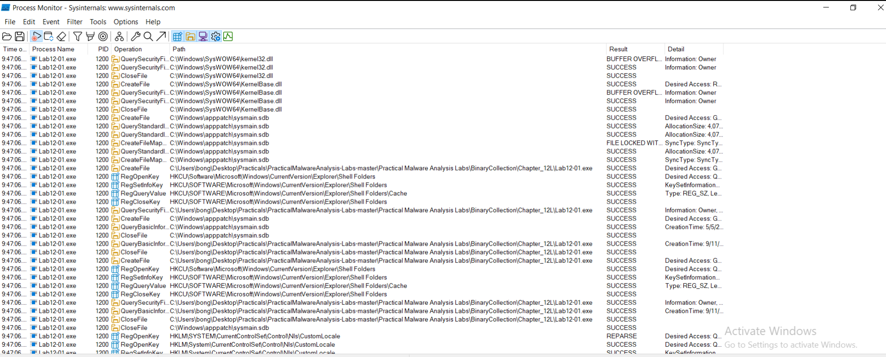
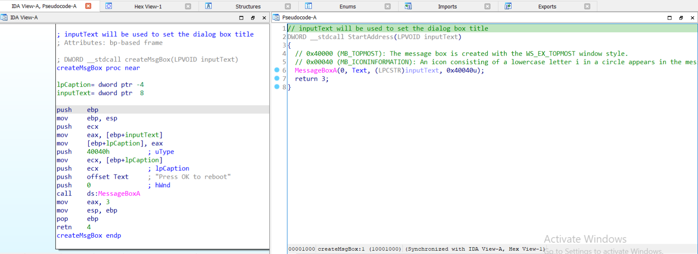

Analyze the malware found in the file `Lab12-01.exe` and `Lab12-01.dll`. Make sure that these files are in the same directory when performing the analysis.

### Static Analysis
- `Lab12-01.exe`
    - Behaviors of Interest
        - DLL injection of `Lab12-01.dll` into `explorer.exe`

    - Imports
        - Process
            - OpenProcess, CreateRemoteThread, GetModuleHandleA, WriteProcessMemory, VirtualAllocEx, GetProcAddress, LoadLibraryA, ExitProcess, TerminateProcess, GetCurrentProcess
        - File
            - GetCurrentDirectoryA, GetModuleFileNameA, WriteFile

    - Miscellaneous
        - No signs of packing, `Microsoft Visual C++ 6.0` compiled executable

    - Embedded Strings
        ```
        explorer.exe
        <unknown>
        LoadLibraryA
        kernel32.dll
        Lab12-01.dll
        EnumProcesses
        GetModuleBaseNameA
        psapi.dll
        EnumProcessModules
        ```

    - CAPA Report
        ```
        ┍━━━━━━━━━━━━━━━━━━━━━━━━┯━━━━━━━━━━━━━━━━━━━━━━━━━━━━━━━━━━━━━━━━━━━━━━━━━━━━━━━━━━━━━━━━━━━━━━━━━━━━━━━━━━━━━━━━━━━━━━━━━━━━━━━━━━━━━━━━━━━━━━━━━━━━━━━━━━━━━━━━━━━━━━━━━┑
        │ md5                    │ dafbea2a91f86bf5e52efa3bac3f1b16                                                                                                                │
        │ sha1                   │ 6a41735369934a212fc90dbd8c847c26270b3fba                                                                                                        │
        │ sha256                 │ 1fb3c4a9109ef171fa67bdf90e67f09ef25b5a1d401dc20dc45cfccf1e4fbd99                                                                                │
        │ analysis               │ static                                                                                                                                          │
        │ os                     │ windows                                                                                                                                         │
        │ format                 │ pe                                                                                                                                              │
        │ arch                   │ i386                                                                                                                                            │
        │ path                   │ C:/Users/bong/Desktop/Practicals/PracticalMalwareAnalysis-Labs-master/Practical Malware Analysis Labs/BinaryCollection/Chapter_12L/Lab12-01.exe │
        ┕━━━━━━━━━━━━━━━━━━━━━━━━┷━━━━━━━━━━━━━━━━━━━━━━━━━━━━━━━━━━━━━━━━━━━━━━━━━━━━━━━━━━━━━━━━━━━━━━━━━━━━━━━━━━━━━━━━━━━━━━━━━━━━━━━━━━━━━━━━━━━━━━━━━━━━━━━━━━━━━━━━━━━━━━━━━┙

        ┍━━━━━━━━━━━━━━━━━━━━━━━━┯━━━━━━━━━━━━━━━━━━━━━━━━━━━━━━━━━━━━━━━━━━━━━━━━━━━━━━━━━━━━━━━━━━━━━━━━━━━━━━━━━━━━┑
        │ ATT&CK Tactic          │ ATT&CK Technique                                                                   │
        ┝━━━━━━━━━━━━━━━━━━━━━━━━┿━━━━━━━━━━━━━━━━━━━━━━━━━━━━━━━━━━━━━━━━━━━━━━━━━━━━━━━━━━━━━━━━━━━━━━━━━━━━━━━━━━━━┥
        │ DEFENSE EVASION        │ Process Injection::Dynamic-link Library Injection T1055.001                        │
        │                        │ Process Injection::Thread Execution Hijacking T1055.003                            │
        │                        │ Reflective Code Loading T1620                                                      │
        ├────────────────────────┼────────────────────────────────────────────────────────────────────────────────────┤
        │ DISCOVERY              │ File and Directory Discovery T1083                                                 │
        ├────────────────────────┼────────────────────────────────────────────────────────────────────────────────────┤
        │ EXECUTION              │ Shared Modules T1129                                                               │
        ┕━━━━━━━━━━━━━━━━━━━━━━━━┷━━━━━━━━━━━━━━━━━━━━━━━━━━━━━━━━━━━━━━━━━━━━━━━━━━━━━━━━━━━━━━━━━━━━━━━━━━━━━━━━━━━━┙


        ┍━━━━━━━━━━━━━━━━━━━━━━━━━━━━━┯━━━━━━━━━━━━━━━━━━━━━━━━━━━━━━━━━━━━━━━━━━━━━━━━━━━━━━━━━━━━━━━━━━━━━━━━━━━━━━━┑
        │ MBC Objective               │ MBC Behavior                                                                  │
        ┝━━━━━━━━━━━━━━━━━━━━━━━━━━━━━┿━━━━━━━━━━━━━━━━━━━━━━━━━━━━━━━━━━━━━━━━━━━━━━━━━━━━━━━━━━━━━━━━━━━━━━━━━━━━━━━┥
        │ DISCOVERY                   │ File and Directory Discovery [E1083]                                          │
        ├─────────────────────────────┼───────────────────────────────────────────────────────────────────────────────┤
        │ PROCESS                     │ Create Thread [C0038]                                                         │
        ┕━━━━━━━━━━━━━━━━━━━━━━━━━━━━━┷━━━━━━━━━━━━━━━━━━━━━━━━━━━━━━━━━━━━━━━━━━━━━━━━━━━━━━━━━━━━━━━━━━━━━━━━━━━━━━━┙

        ┍━━━━━━━━━━━━━━━━━━━━━━━━━━━━━━━━━━━━━━━━━━━━━━━━━━━━━━┯━━━━━━━━━━━━━━━━━━━━━━━━━━━━━━━━━━━━━━━━━━━━━━━━━━━━━━┑
        │ Capability                                           │ Namespace                                            │
        ┝━━━━━━━━━━━━━━━━━━━━━━━━━━━━━━━━━━━━━━━━━━━━━━━━━━━━━━┿━━━━━━━━━━━━━━━━━━━━━━━━━━━━━━━━━━━━━━━━━━━━━━━━━━━━━━┥
        │ get common file path                                 │ host-interaction/file-system                         │
        │ inject dll                                           │ host-interaction/process/inject                      │
        │ inject thread                                        │ host-interaction/process/inject                      │
        │ link function at runtime on Windows (4 matches)      │ linking/runtime-linking                              │
        ┕━━━━━━━━━━━━━━━━━━━━━━━━━━━━━━━━━━━━━━━━━━━━━━━━━━━━━━┷━━━━━━━━━━━━━━━━━━━━━━━━━━━━━━━━━━━━━━━━━━━━━━━━━━━━━━┙
        ```
- `Lab12-01.dll`
    - Behaviors of Interest
        - Infinitely create new message boxes

    - Imports
        - Process
            - CreateThread, GetProcAddress, LoadLibraryA, ExitProcess, TerimnateProcess, GetCurrentProcess, GetCurrentThreadId
        - File
            - WriteFile, GetModuleFileNameA, FlushFileBuffers
        - Miscellaneous
            - Critical Section
                - InitialiseCriticalSection, EnterCriticalSection, DeleteCriticalSection, LeaveCriticalSection
            - Environment Strings
                - GetEnvironmentStrings
            - GUI
                - MessageBoxA

    - Exports
        - No exported functions, which is unusual for DLLs. Only consists of `Dllmain`

    - Miscellaneous
        - No signs of packing, `Microsoft Visual C++ 6.0 DLL` compiled DLL

    - Embedded Strings
        ```
        Microsoft Visual C++ Runtime Library
        Runtime Error!
        Program: 
        <program name unknown>
        GetLastActivePopup
        GetActiveWindow
        MessageBoxA
        user32.dll
        H:mm:ss
        dddd, MMMM dd, yyyy
        M/d/yy
        December
        November
        October
        September
        August
        July
        June
        April
        March
        February
        January
        Saturday
        Friday
        Thursday
        Wednesday
        Tuesday
        Monday
        Sunday
        SunMonTueWedThuFriSat
        JanFebMarAprMayJunJulAugSepOctNovDec
        Sleep
        Press OK to reboot
        Practical Malware Analysis %d
        ```

    - CAPA Report
        ```
        ┍━━━━━━━━━━━━━━━━━━━━━━━━┯━━━━━━━━━━━━━━━━━━━━━━━━━━━━━━━━━━━━━━━━━━━━━━━━━━━━━━━━━━━━━━━━━━━━━━━━━━━━━━━━━━━━━━━━━━━━━━━━━━━━━━━━━━━━━━━━━━━━━━━━━━━━━━━━━━━━━━━━━━━━━━━━━┑
        │ md5                    │ a6fb0d8fdea1c15afba7a5ddb3d2867b                                                                                                                │
        │ sha1                   │ d38b6cadbdbc8ef6d29ffcdde80d5bcc9519c8e1                                                                                                        │
        │ sha256                 │ 0ea89a83b84b8d20e259bacb6b0d1b176c8327f097c54749ae832981f2a0095a                                                                                │
        │ analysis               │ static                                                                                                                                          │
        │ os                     │ windows                                                                                                                                         │
        │ format                 │ pe                                                                                                                                              │
        │ arch                   │ i386                                                                                                                                            │
        │ path                   │ C:/Users/bong/Desktop/Practicals/PracticalMalwareAnalysis-Labs-master/Practical Malware Analysis Labs/BinaryCollection/Chapter_12L/Lab12-01.dll │
        ┕━━━━━━━━━━━━━━━━━━━━━━━━┷━━━━━━━━━━━━━━━━━━━━━━━━━━━━━━━━━━━━━━━━━━━━━━━━━━━━━━━━━━━━━━━━━━━━━━━━━━━━━━━━━━━━━━━━━━━━━━━━━━━━━━━━━━━━━━━━━━━━━━━━━━━━━━━━━━━━━━━━━━━━━━━━━┙


        ┍━━━━━━━━━━━━━━━━━━━━━━━━━━━━━┯━━━━━━━━━━━━━━━━━━━━━━━━━━━━━━━━━━━━━━━━━━━━━━━━━━━━━━━━━━━━━━━━━━━━━━━━━━━━━━━┑
        │ MBC Objective               │ MBC Behavior                                                                  │
        ┝━━━━━━━━━━━━━━━━━━━━━━━━━━━━━┿━━━━━━━━━━━━━━━━━━━━━━━━━━━━━━━━━━━━━━━━━━━━━━━━━━━━━━━━━━━━━━━━━━━━━━━━━━━━━━━┥
        │ PROCESS                     │ Create Thread [C0038]                                                         │
        ┕━━━━━━━━━━━━━━━━━━━━━━━━━━━━━┷━━━━━━━━━━━━━━━━━━━━━━━━━━━━━━━━━━━━━━━━━━━━━━━━━━━━━━━━━━━━━━━━━━━━━━━━━━━━━━━┙

        ┍━━━━━━━━━━━━━━━━━━━━━━━━━━━━━━━━━━━━━━━━━━━━━━━━━━━━━━┯━━━━━━━━━━━━━━━━━━━━━━━━━━━━━━━━━━━━━━━━━━━━━━━━━━━━━━┑
        │ Capability                                           │ Namespace                                            │
        ┝━━━━━━━━━━━━━━━━━━━━━━━━━━━━━━━━━━━━━━━━━━━━━━━━━━━━━━┿━━━━━━━━━━━━━━━━━━━━━━━━━━━━━━━━━━━━━━━━━━━━━━━━━━━━━━┥
        │ create thread (2 matches)                            │ host-interaction/thread/create                       │
        ┕━━━━━━━━━━━━━━━━━━━━━━━━━━━━━━━━━━━━━━━━━━━━━━━━━━━━━━┷━━━━━━━━━━━━━━━━━━━━━━━━━━━━━━━━━━━━━━━━━━━━━━━━━━━━━━┙
        ```

### Dynamic Analysis
- Process
    - Process injection of `explorer.exe` to load the malicious `Lab12-01.dll` DLL, and execute its payload, which continually creates threads of new message boxes.
    

### Reverse Engineering
- `Lab12-01.exe`
    - `main` (`004010D0`)
        - Program entrypoint
        - Loads the `psapi.dll` DLL and gets the addresses to its `EnumProcessModules`, `GetModuleBaseNameA` and `EnumProcesses` API functions
            
        - Prepare `currentDir` which stores the current directory filepath, concatenated with the malicious DLL `Lab12-01.dll`
            ```
            <Current Directory File Path>\Lab12-01.dll
            ```
        - Loops through each process returned by `EnumProcesses` to find the victim process, `explorer.exe` by calling `checkProcess` subroutine at `00401000`
            

        - Once a matching victim process (`explorer.exe`) is found, get a handle to the process with PROCESS_CREATE_THREAD, PROCESS_VM_OPERATION, PROCESS_VM_READ, PROCESS_VM_WRITE and PROCESS_QUERY_INFORMATION access.
        - Allocate memory space in the victim process and write the malicious `Lab12-01.dll` DLL's file path to the victim process's memory, with MEM_COMMIT and MEM_RESERVE access
        - Create a remote thread that executes immediately to load the malicious DLL
            
        - Return the status code of the payload execution, with `0` indicating a successful execution, and non-zero code indicating unsuccessful execution

    - `checkProcess` (`00401000`)
        - Open the given process and get its module basename to check if it matches `explorer.exe`
        - If a match is found, return `1` to the caller, if not return `0`
        

- `Lab12-01.dll`
    - `Dllmain` (`100010A0`)
        - DLL entrypoint
        - Ensures that the DLL is loaded by a process by checking the value of `fwdReason` to `1` (DLL_PROCESS_ATTACH)
        - Creates a new thread which immediately calls subroutine at `10001030` or `payload` to deliver the malware payload
        

    - `payload` (`10001030`)
        - Enters an infinite loop which creates a new thread that immediately calls subroutine at `10001000` or `createMsgBox` to create message boxes to be displayed to the infected user. 
        
        - The thread is passed the `Parameter` string as its argument which contains the iteration count of the infinite loop, as well as the parameter text:
            ```
            Practical Malware Analysis <Iteration Count>
            ```
        - After the thread is created, the subroutine sleeps for a minute, before continuing its infinite loop.
    - `createMsgBox` (`10001000`)
        - Creates a MessageBox with the received text argument set as its caption. The message box is set with the following configurations:
            - `0x40000` (`MB_TOPMOST`): The message box is created with the WS_EX_TOPMOST window style.
            - `0x00040` (`MB_ICONINFORMATION`): An icon consisting of a lowercase letter i in a circle appears in the message box. 
        

### Questions
1. What happens when you run the malware executable?
    - The malware performs DLL injection on the `explorer.exe` process to load and execute the `Lab12-01.dll` DLL

2. What process is being injected?
    - `explorer.exe`

3. How can you make the malware stop the pop-ups?
    - The pop-ups are generated infinitely until the parent process `explorer.exe` is closed. To stop the pop-ups, either restart the `explorer.exe` process or restart the infected machine, which should fix the issue since the malware does not have any persistance mechanisms.

4. How does this malware operate?
    - It performs DLL injection on the `explorer.exe` process to load and execute the `Lab12-01.dll` DLL. Upon execution, the `Dllmain` function of the malicious DLL will be executed, which goes into an infinite loop that continually creates new threads to display pop-up messages in the following format:
        ```
        Practical Malware Analysis <Iteration Count>
        ```