# Lab 13-1
Analyze the malware found in the file `Lab13-01.exe`.

## Reverse Engineering
- `main` (`004013ED`)
    > Program entrypoint
    - Extracts embedded resource by calling `extractEmbeddedResource` at `00401300`
    - Initialises networking functionalities before calling the `payload` function at `004011C9` to deliver the malware's payload
    - Malware sleeps for 500ms prior to delivering its payload and sleeps for 30 seconds afterwards
    - Malware continually executes payload until the `successExecution` return value from the `payload` function is non-zero. Loop continues running until a successful connection to the C2 connection domain is made
    - Post-execution cleanup by calling `WSACleanup()` to clean up network functions
    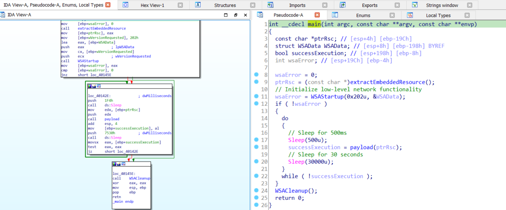

- `extractEmbeddedResource` (`00401300`)
    > Extracts malware's embedded resource at (`RT_RCDATA`:`101`)
    - Searches for the embedded resource at (`RT_RCDATA`:`101`) and loads it
    - The embedded resource is XOR byte-encoded with the key `0x3B`. After loading the resource, it is decoded by calling the `decodeResource` function at `00401190`.
    - The decoded resource is then returned to the caller. If any error occurred during the function, `0` will be returned instead
    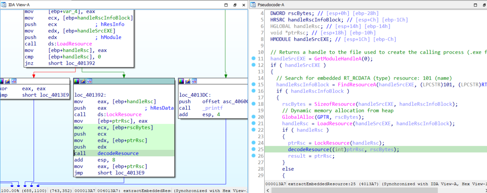
    - Manually decoding the embedded resource presents a C2 domain:
        ```
        www.practicalmalwareanalysis.com
        ```
- `decodeResource` (`00401190`)
    > Extracts the XOR byte-encoded resource
    - Loops through each byte of the resource and performs a byte-wise XOR with the key `0x3B`
    - The final decoded bytes are then returned to the caller
    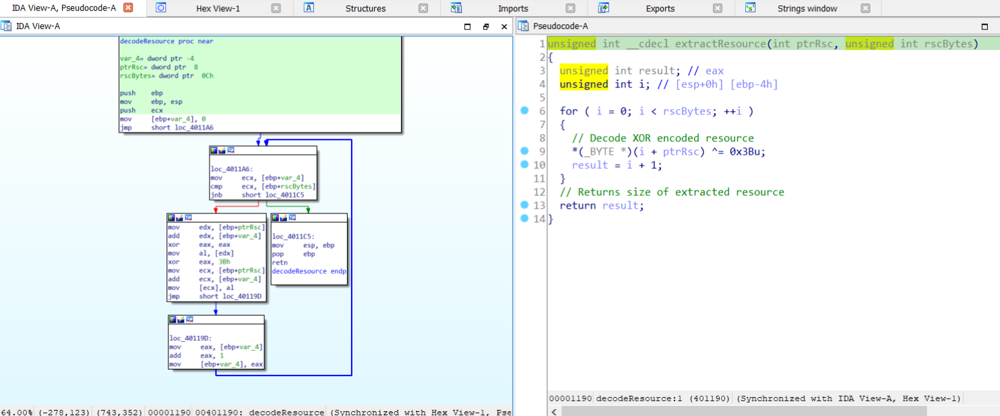

- `payload` (`004011C9`)
    > Delivers malware payload
    - Prepares variables for connection to the malware's C2 server:
        - User agent: `Mozilla/4.0`
        - Hostname:
            - Copies up to 12 characters
            - Encode hostname using `encodeHostname` function at `004010B1`, which applies a custom base64 encoding
        - Connection domain:
            ```
            http://www.practicalmalwareanalysis.com/<encoded hostname>/
            ```
        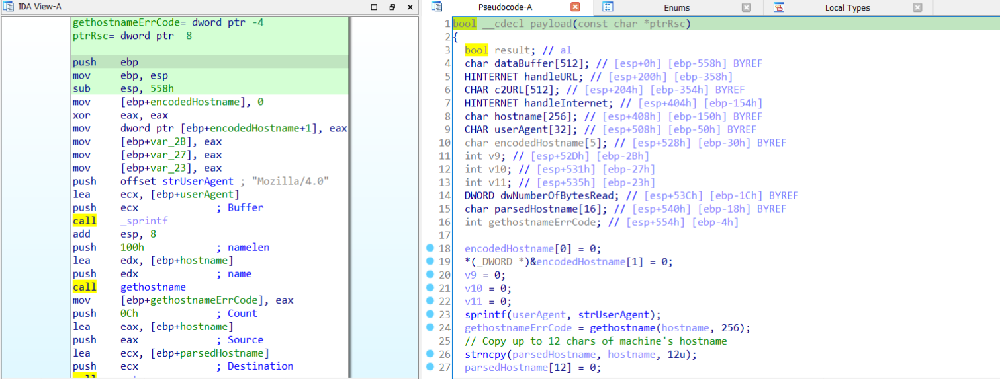
        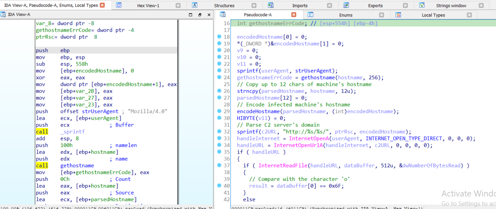
    - Makes a connection to the connection domain and parse response received. If the first letter of the connection received is the letter `o`, this indicates a successful connection.
    - Returns the result of the connection status, with `0` indicating an error
    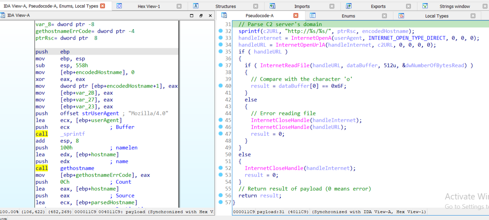

- `encodeHostname` (`004010B1`)
    > Performs base64 encoding on the infected machine's hostname
    - Processes the hostname string in blocks of 3 bytes at a time for base64 scheme
        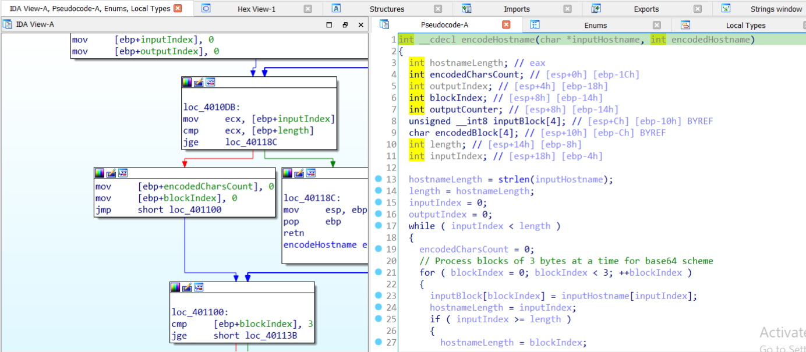
    - Encodes each character using a custom base64 character set by calling `customBase64` at `00401000`
        
    - Processes block of 3 bytes into groups of 4 byes to get the output of the base64 encoding
        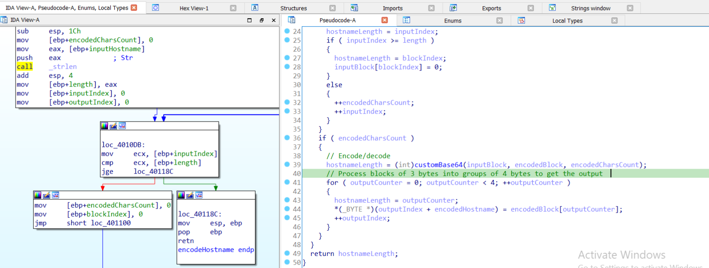

- `customBase64` (`00401000`)
    > Encodes each character using a custom base64 character set
    - Encodes each character using the custom base64 character set specified by `base64Table` at `004050E8`, adding the `=` padding character where appropriate for the last two characters
    - Custom base64 character set:
        ```
        ABCDEFGHIJKLMNOPQRSTUVWXYZabcdefghijklmnopqrstuvwxyz0123456789+/
        ```
    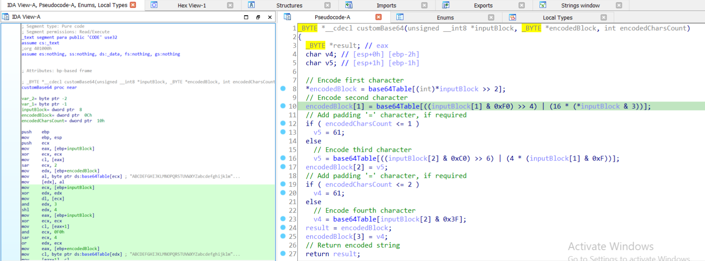

## Questions
1. Compare the strings in the malware (from the output of the strings command) with the information available via dynamic analysis. Based on this comparison, which elements might be encoded?
    - Embedded strings
        ```
        ABCDEFGHIJKLMNOPQRSTUVWXYZabcdefghijklmnopqrstuvwxyz0123456789+/
        http://%s/%s/
        KIZXORXZWVZWLZI^ZUZWBHRH
        ```
    - A C2 server URL (`www.practicalmalwareanalysis.com`) might be encoded
    - Dynamic Analysis
        - Captured packets for HTTP connection to the C2 connection domain
            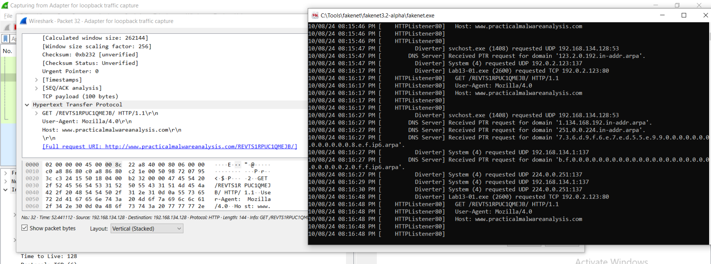
        - Procdot visualisation
            

2. Use IDA Pro to look for potential encoding by searching for the string `xor`. What type of encoding do you find?
    - Byte-wise XOR encoding using the `0x3B` key

3. What is the key used for encoding and what content does it encode?
    - Key: `0x3B`
    - It encodes the C2 server's connection domain:
        ```
        www.practicalmalwareanalysis.com
        ```

4. Use the static tools FindCrypt2, Krypto ANALyzer (KANAL), and the IDA Entropy Plugin to identify any other encoding mechanisms. What do you find?
    - FindCrypt2 and KANAL detected a base64 table, likely for a custom base64 encoding scheme.
        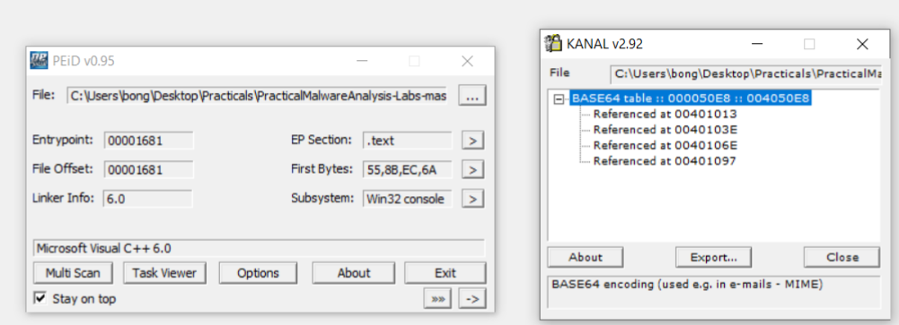
        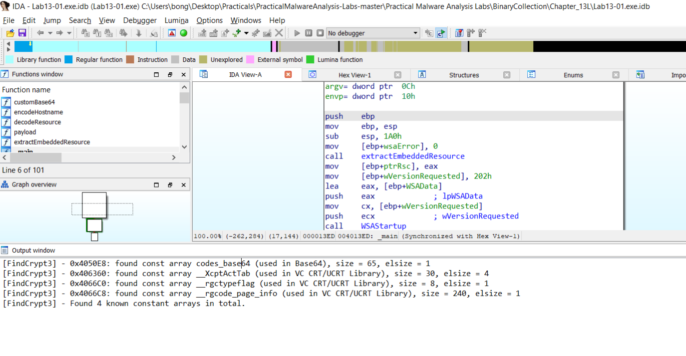

5. What type of encoding is used for a portion of the network traffic sent by the malware?
    - Custom base64 encoding

6. Where is the Base64 function in the disassembly?
    - `encodeHostname` (`004010B1`)
    - `customBase64` (`00401000`)
    - `base64Table` (`004050E8`)

7. What is the maximum length of the Base64-encoded data that is sent? What is encoded?
    - Maximum of 12 characters
    - The infected machine's hostname is encoded using the custom base64 character set

8. In this malware, would you ever see the padding characters (= or ==) in the Base64-encoded data?
    - Yes, if the infected machine's hostname has odd number of characters

9. What does this malware do?
    - It extracts an embedded resource with type:name (`RT_RCDATA`:`101`)
    - The embedded resource is XOR byte-encoded with the key as `0x3B`. Decoding the resource reveals a C2 connection domain:
        ```
        www.practicalmalwareanalysis.com
        ```
    - Malware enters a loop that keeps running until a successful connection (receives `o` character) to the C2 connection domain is made, with the following data and parameters:
        - User agent: `Mozilla/4.0`
        - Hostname (custom base64 encoded)
        - Connection domain:
            ```
            http://www.practicalmalwareanalysis.com/<encoded hostname>/
            ```