# Lab 13-3
Analyze the malware found in the file Lab13-03.exe.

## Static Analysis
- Imports
    - Process
        - VirtualAlloc, GetCurrentProcess, TerminateProcess, CreateThread
    
    - File
        - WriteFile

    - Network
        - WSAStartup, WSASocketA, gethostbyvalue, connect, htons 

    - Miscellaneous
        - GetEnvironmentStrings

- Encoding
    - Malware exhibited signes of encoding, particularly using Rijndael (AES) cipher, and a custom base64 encoding character set
    - Rijndael (AES) cipher
        - PEID
            

        - FindCrypt3
            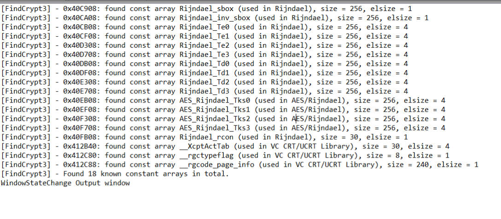

        - Occurrences of `xor` instruction
            
    - Custom Base64
        - Embedded Strings
            ```
            CDEFGHIJKLMNOPQRSTUVWXYZABcdefghijklmnopqrstuvwxyzab0123456789+/
            ```
    - Potential strings of interest
        ```
        ERROR: API    = %s.
        error code = %d.
        message    = %s.
        cmd.exe
        ijklmnopqrstuvwx
        www.practicalmalwareanalysis.com
        lkjiponmtsrqxwvu
        11nV_#<)
        ```

- Miscellaneous
    - No signs of packing, `Microsoft Visual C++ 6.0` compiled binary
    - No embedded resources

- Embedded Strings
    - Strings of Interest
        - Custom Base64 character set
            ```
            CDEFGHIJKLMNOPQRSTUVWXYZABcdefghijklmnopqrstuvwxyzab0123456789+/
            ```
        - Some form of key/block encoding mechanism
            ```
            Data not multiple of Block Size
            Empty key
            Incorrect key length
            Incorrect block length
            ```
        - Domain: `www.practicalmalwareanalysis.com`
        - Executable: `cmd.exe`

    - Strings with promise
        ```
        ios::eofbit set
        ios::failbit set
        ios::badbit set
        string too long
        invalid string position
        Unknown exception
        CDEFGHIJKLMNOPQRSTUVWXYZABcdefghijklmnopqrstuvwxyzab0123456789+/
        ERROR: API    = %s.
        error code = %d.
        message    = %s.
        cmd.exe
        ijklmnopqrstuvwx
        www.practicalmalwareanalysis.com
        Object not Initialized
        Data not multiple of Block Size
        Empty key
        Incorrect key length
        Incorrect block length
        lkjiponmtsrqxwvu
        11nV_#<)
        Object not Initializ
        lkjiponmtsrqxwvu
        11nV_#<)
        .?AVexception@@
        .?AVios_base@std@@
        .?AV?$basic_ios@DU?$char_traits@D@std@@@std@@
        .?AV?$basic_istream@DU?$char_traits@D@std@@@std@@
        .?AV?$basic_ostream@DU?$char_traits@D@std@@@std@@
        .?AV?$basic_streambuf@DU?$char_traits@D@std@@@std@@
        .?AV?$basic_filebuf@DU?$char_traits@D@std@@@std@@
        .?AV?$basic_ios@GU?$char_traits@G@std@@@std@@
        .?AV?$basic_istream@GU?$char_traits@G@std@@@std@@
        .?AV?$basic_ostream@GU?$char_traits@G@std@@@std@@
        .?AV?$basic_filebuf@GU?$char_traits@G@std@@@std@@
        .?AV?$basic_streambuf@GU?$char_traits@G@std@@@std@@
        .?AVruntime_error@std@@
        .?AVfailure@ios_base@std@@
        .?AVfacet@locale@std@@
        .?AV_Locimp@locale@std@@
        .?AVlogic_error@std@@
        .?AVlength_error@std@@
        .?AVout_of_range@std@@
        .?AVtype_info@@
        ```

- CAPA Report
    ```
    ┍━━━━━━━━━━━━━━━━━━━━━━━━┯━━━━━━━━━━━━━━━━━━━━━━━━━━━━━━━━━━━━━━━━━━━━━━━━━━━━━━━━━━━━━━━━━━━━━━━━━━━━━━━━━━━━━━━━━━━━━━━━━━━━━━━━━━━━━━━━━━━━━━━━━━━━━━━━━━━━━━━━━━━━━━━━━━━━━━┑
    │ md5                    │ 98ea0fe0594f0f373d9791886a01db8c                                                                                                                     │
    │ sha1                   │ e98350347b71658ad0e1b4282dc38446462b8166                                                                                                             │
    │ sha256                 │ 86054002565c929215b82615477652d24379b9119bc33ef7f41706ee7e125379                                                                                     │
    │ analysis               │ static                                                                                                                                               │
    │ os                     │ windows                                                                                                                                              │
    │ format                 │ pe                                                                                                                                                   │
    │ arch                   │ i386                                                                                                                                                 │
    │ path                   │ C:/Users/bong/Desktop/Practicals/PracticalMalwareAnalysis-Labs-master/Practical Malware Analysis Labs/BinaryCollection/Chapter_13L/13.3/Lab13-03.exe │
    ┕━━━━━━━━━━━━━━━━━━━━━━━━┷━━━━━━━━━━━━━━━━━━━━━━━━━━━━━━━━━━━━━━━━━━━━━━━━━━━━━━━━━━━━━━━━━━━━━━━━━━━━━━━━━━━━━━━━━━━━━━━━━━━━━━━━━━━━━━━━━━━━━━━━━━━━━━━━━━━━━━━━━━━━━━━━━━━━━━┙

    ┍━━━━━━━━━━━━━━━━━━━━━━━━┯━━━━━━━━━━━━━━━━━━━━━━━━━━━━━━━━━━━━━━━━━━━━━━━━━━━━━━━━━━━━━━━━━━━━━━━━━━━━━━━━━━━━┑
    │ ATT&CK Tactic          │ ATT&CK Technique                                                                   │
    ┝━━━━━━━━━━━━━━━━━━━━━━━━┿━━━━━━━━━━━━━━━━━━━━━━━━━━━━━━━━━━━━━━━━━━━━━━━━━━━━━━━━━━━━━━━━━━━━━━━━━━━━━━━━━━━━┥
    │ DEFENSE EVASION        │ Obfuscated Files or Information T1027                                              │
    ┕━━━━━━━━━━━━━━━━━━━━━━━━┷━━━━━━━━━━━━━━━━━━━━━━━━━━━━━━━━━━━━━━━━━━━━━━━━━━━━━━━━━━━━━━━━━━━━━━━━━━━━━━━━━━━━┙


    ┍━━━━━━━━━━━━━━━━━━━━━━━━━━━━━┯━━━━━━━━━━━━━━━━━━━━━━━━━━━━━━━━━━━━━━━━━━━━━━━━━━━━━━━━━━━━━━━━━━━━━━━━━━━━━━━┑
    │ MBC Objective               │ MBC Behavior                                                                  │
    ┝━━━━━━━━━━━━━━━━━━━━━━━━━━━━━┿━━━━━━━━━━━━━━━━━━━━━━━━━━━━━━━━━━━━━━━━━━━━━━━━━━━━━━━━━━━━━━━━━━━━━━━━━━━━━━━┥
    │ COMMUNICATION               │ DNS Communication::Resolve [C0011.001]                                        │
    │                             │ Interprocess Communication::Create Pipe [C0003.001]                           │
    │                             │ Socket Communication::Connect Socket [C0001.004]                              │
    │                             │ Socket Communication::Create TCP Socket [C0001.011]                           │
    │                             │ Socket Communication::Initialize Winsock Library [C0001.009]                  │
    │                             │ Socket Communication::TCP Client [C0001.008]                                  │
    ├─────────────────────────────┼───────────────────────────────────────────────────────────────────────────────┤
    │ CRYPTOGRAPHY                │ Encrypt Data::AES [C0027.001]                                                 │
    ├─────────────────────────────┼───────────────────────────────────────────────────────────────────────────────┤
    │ DEFENSE EVASION             │ Obfuscated Files or Information::Encryption-Standard Algorithm [E1027.m05]    │
    ├─────────────────────────────┼───────────────────────────────────────────────────────────────────────────────┤
    │ FILE SYSTEM                 │ Read File [C0051]                                                             │
    │                             │ Writes File [C0052]                                                           │
    ├─────────────────────────────┼───────────────────────────────────────────────────────────────────────────────┤
    │ PROCESS                     │ Create Process [C0017]                                                        │
    │                             │ Create Thread [C0038]                                                         │
    │                             │ Terminate Process [C0018]                                                     │
    ┕━━━━━━━━━━━━━━━━━━━━━━━━━━━━━┷━━━━━━━━━━━━━━━━━━━━━━━━━━━━━━━━━━━━━━━━━━━━━━━━━━━━━━━━━━━━━━━━━━━━━━━━━━━━━━━┙

    ┍━━━━━━━━━━━━━━━━━━━━━━━━━━━━━━━━━━━━━━━━━━━━━━━━━━━━━━┯━━━━━━━━━━━━━━━━━━━━━━━━━━━━━━━━━━━━━━━━━━━━━━━━━━━━━━┑
    │ Capability                                           │ Namespace                                            │
    ┝━━━━━━━━━━━━━━━━━━━━━━━━━━━━━━━━━━━━━━━━━━━━━━━━━━━━━━┿━━━━━━━━━━━━━━━━━━━━━━━━━━━━━━━━━━━━━━━━━━━━━━━━━━━━━━┥
    │ resolve DNS                                          │ communication/dns                                    │
    │ create pipe                                          │ communication/named-pipe/create                      │
    │ create two anonymous pipes                           │ communication/named-pipe/create                      │
    │ initialize Winsock library                           │ communication/socket                                 │
    │ act as TCP client                                    │ communication/tcp/client                             │
    │ encrypt data using AES (5 matches)                   │ data-manipulation/encryption/aes                     │
    │ reference AES constants (5 matches)                  │ data-manipulation/encryption/aes                     │
    │ read file on Windows (2 matches)                     │ host-interaction/file-system/read                    │
    │ write file on Windows (3 matches)                    │ host-interaction/file-system/write                   │
    │ create process on Windows                            │ host-interaction/process/create                      │
    │ terminate process                                    │ host-interaction/process/terminate                   │
    │ create thread (2 matches)                            │ host-interaction/thread/create                       │
    ┕━━━━━━━━━━━━━━━━━━━━━━━━━━━━━━━━━━━━━━━━━━━━━━━━━━━━━━┷━━━━━━━━━━━━━━━━━━━━━━━━━━━━━━━━━━━━━━━━━━━━━━━━━━━━━━┙
    ```
## Reverse Engineering
- `main` (`00401879`)
    > Program entrypoint
    - Initialises AES context structure by calling `initialiseAES` (`00401AC2`), passing in the AES key `ijklmnopqrstuvwx`, a buffer, key size of `16` and block size of `16`
        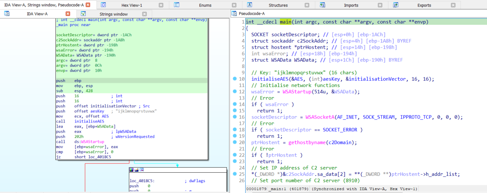
    - Initialise network connection and functions, creates a socket to the malware's C2 server at `www.practicalmalwareanalysis.com:8910`, and connects to the server
        
    - Executes malware payload by calling `deliverPayload` (`004015B7`), passing in the socket and C2 server socketaddr structure object
        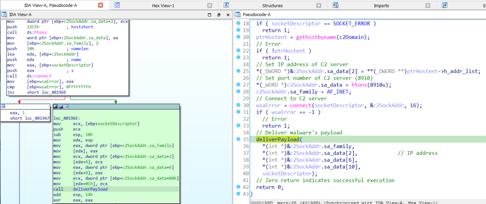

- `initialiseAES` (`00401AC2`)
    > Initialises AES context structure to be used by the malware for subsequent encryption and decryption
    - Utilises a custom structure that we defined as `struct_AES`
        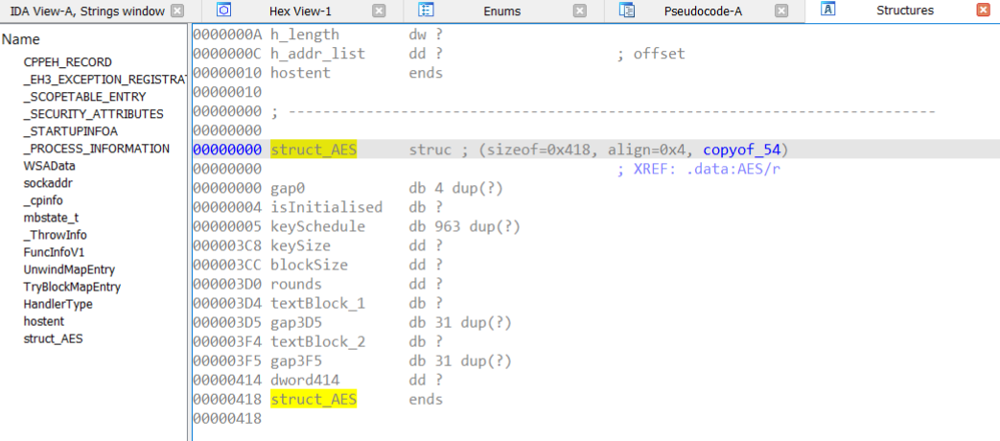
    - Conducts a series of checks/validations prior to initialisation:
        - Non-empty AES key
        - Valid AES key size (16, 24 or 32 bits)
        - Valid AES block size (16, 24, or 32 bits)
        
    - Initialises AES structure:
        - Set AES key `ijklmnopqrstuvwx`
        - Set AES rounds (10 rounds for 128-bit/16 byte keys, 12 rounds for 192-bit/24 byte keys, and 14 rounds for 256-bit/32 byte keys)
            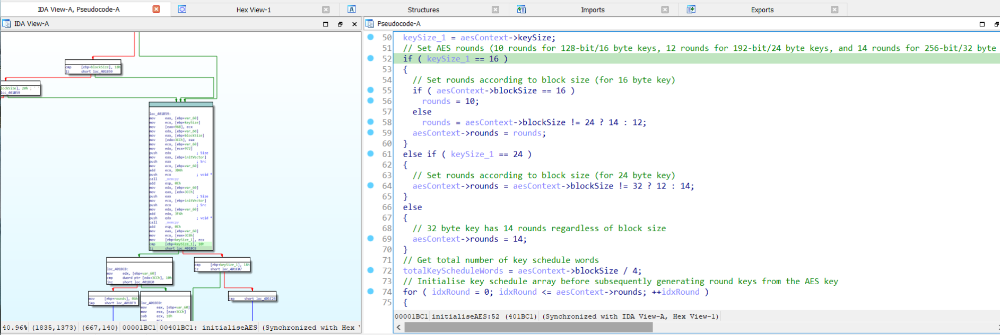
        - Key schedule generation and population
            
        - Key expansion and further transformations
            
            
    - Sets the `isInitialised` status flag for the struct to `1` to indicate that malware is ready for encoding

-  `deliverPayload` (`004015B7`)
    > Creates two pipes, (1) one for reading from the C2 server socket and writing to `cmd.exe`, and (2) another for reading the output from `cmd.exe`, encrypting its contents, and sending it to the C2 server socket
    - Initialises process handles from the current process, and creates two pipes:
        1. Read from C2 server and write to `cmd.exe`
        2. Read from `cmd.exe` and write to C2 server
        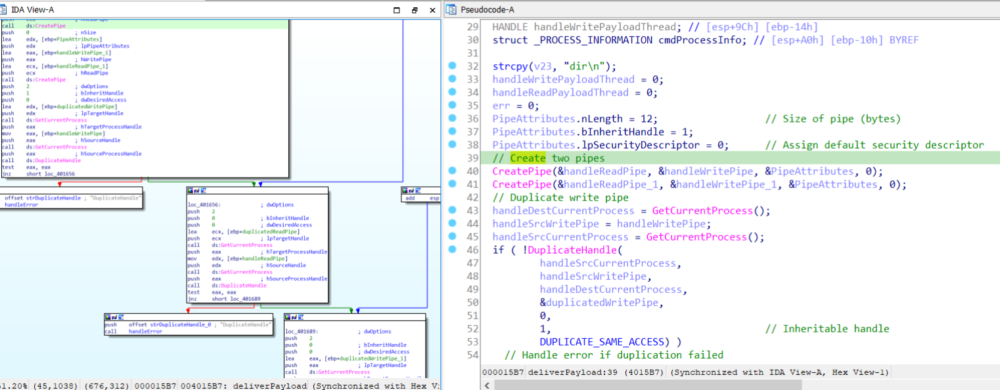
        
    - Initialise STARTUPINFO structure, and pass it as an argument during the creation of a child process for `cmd.exe`
        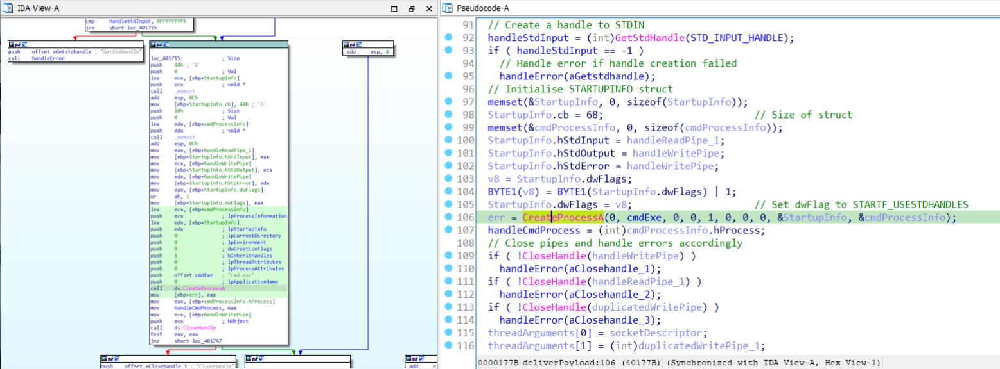
    - Prepares two sets of arguments before creating new threads to execute the payload, calling `executeCommands` (`0040147C`) and `exfiltrateOutput` (`0040132B`)
        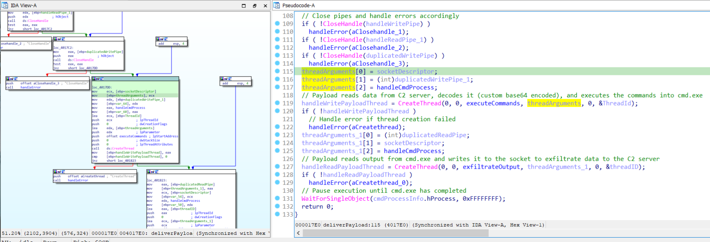
    - Pause execution until child process executing `cmd.exe` has comlpeted

- `handleError` (`00401256`)
    > Handles errors that occur during lifetime of the malware, cleaning up resources and printing an appropriate error message
    - Formats and prints an appropriate error message
    - Write the error message to the STDOUT console
    - Make the process exit
    

- `executeCommands` (`0040147C`)
    > Pipe (1): Read from C2 server and write to `cmd.exe`
    - Thread is connected to a pipe that reads data from a socket connected to the C2 server, and that writes to the child `cmd.exe` process
    - Keep reading up to 1024 bytes from the C2 server socket per iteration in a loop
    - Data received is decoded by calling `decodeBase64` (`00401082`), as the commands received are using a custom base64 character set
    - Decoded data is written to the write pipe, to the connected child `cmd.exe` process
    - Loop continues until the pipe is closed (signalled by `ERROR_NO_DATA` return value)
    

- `decodeBase64` (`00401082`)
    > Custom Base64 decoder
    - Processes data to decode in groups of 4 bytes at a time, decoding each character, and subsequently converting the groups of 6-bits into valid bytes
    - Calls `unmapBase64` (`0040103F`) to unmap base64 encoded data to its 6-bit value
    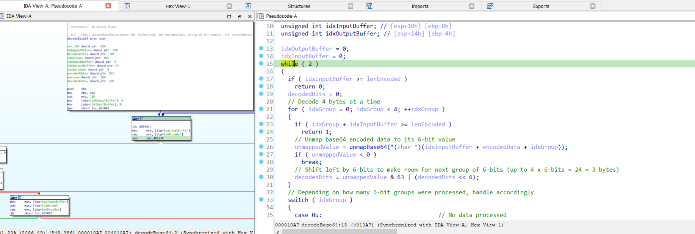
    
    

- `unmapBase64` (`0040103F`)
    > Unmap base64 encoded character to its 6-bit equivalent value
    - References a custom base64 character set at `customBase64Charset` (`004120A4`) to perform the unmapping
        ```
        CDEFGHIJKLMNOPQRSTUVWXYZABcdefghijklmnopqrstuvwxyzab0123456789+/
        ```
    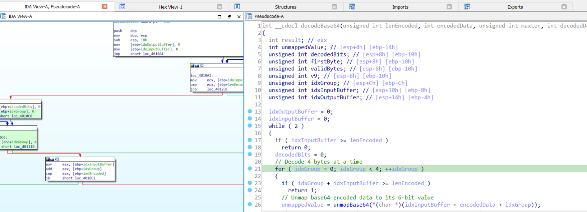

-  `exfiltrateOutput` (`0040132B`)
    > Pipe (2): Read from `cmd.exe` and write to C2 server
    - Thread is connected to a pipe that reads data from the child `cmd.exe` process, and writes to the C2 server socket
    - Keep reading up to 1024 bytes from the child `cmd.exe` process (output) per iteration in a loop
    - Data is encrypted by calling `computeEncryptedBytes` (`004012E9`) first to calculate the number of bytes to be encrypted first, then subsequently `aesCipher` (`0040352D`) to encrypt the bytes
    - Encrypted data is written to the write pipe, to the connected C2 server socket
    - Loop continues until the pipe has ended (signalled by `ERROR_BROKEN_PIPE` return value)
    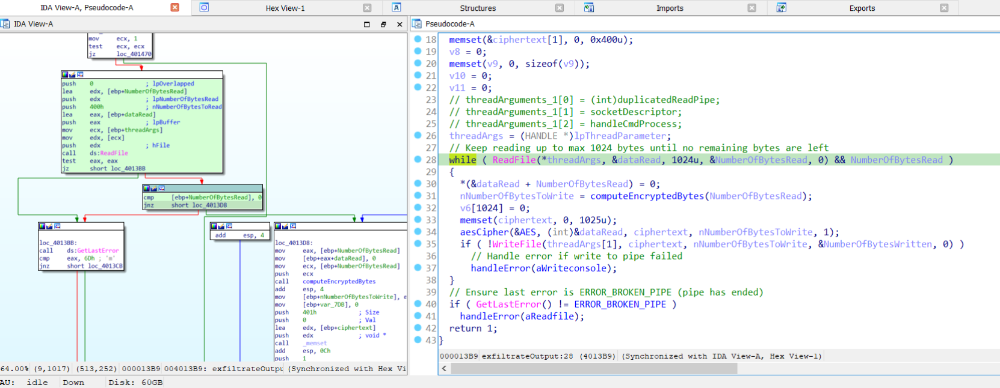

- `computeEncryptedBytes` (`004012E9`)
    > Calculates the number of bytes required for encryption, accounting for padding (ensures total number of bytes are multiple of 16)

    

- `aesCipher` (`0040352D`)
    > AES Cipher, responsible for encryption or decryption of bytes
    - First ensures that the AES structure has been initialised, and that the data size is valid
        
    - Supports 3 different modes of operation:
        1. Encryption
            
            - XORs each block by calling `xorBlocks` (`00403990`)
            - Performs round transformation by calling `roundTransform` (`00402DA8`)

        2. Decryption
            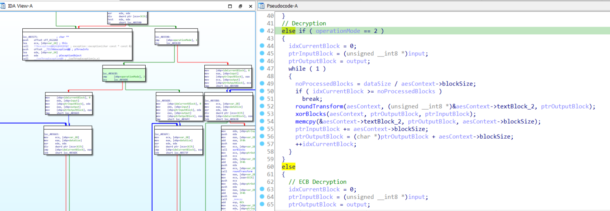
            - Performs round transformation by calling `roundTransform` (`00402DA8`)

        3. ECB Decryption
            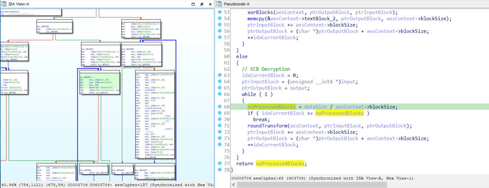
            - Performs round transformation by calling `roundTransform` (`00402DA8`)

- `xorBlocks` (`00403990`)
    > XOR input and output block together

    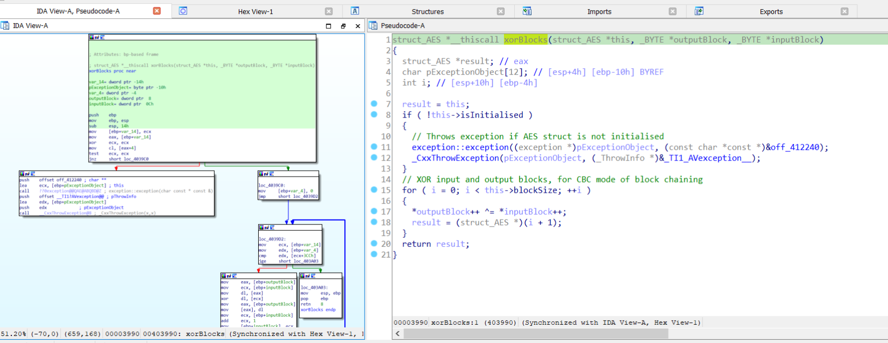

- `roundTransform` (`00402DA8`)
    > Performs round transformation for each block

    
    

## Dynamic Analysis
- Process Monitoring

- Registry

- Service

- Network


## Questions
1. Compare the output of strings with the information available via dynamic analysis. Based on this comparison, which elements might be encoded?
    - Potential strings of interest:
        ```
        ERROR: API    = %s.
        error code = %d.
        message    = %s.
        cmd.exe
        ijklmnopqrstuvwx
        www.practicalmalwareanalysis.com
        lkjiponmtsrqxwvu
        11nV_#<)
        ```
    - These strings could be some information about the infected machine, or a command to be sent to the malware's C2 server
    
2. Use static analysis to look for potential encoding by searching for the string `xor`. What type of encoding do you find?
    - It is used extensively in the AES cipher functions
    

3. Use static tools like `FindCrypt2`, `KANAL`, and the `IDA Entropy Plugin` to identify any other encoding mechanisms. How do these findings compare with the XOR findings?
    - These tools corroborate the `xor` findings, indicating the use of Rijndael (AES) cipher 

4. Which two encoding techniques are used in this malware?
    - AES and custom base64

5. For each encoding technique, what is the key?
    - AES
        ```
        ijklmnopqrstuvwx
        ```
    - Base64
        ```
        CDEFGHIJKLMNOPQRSTUVWXYZABcdefghijklmnopqrstuvwxyzab0123456789+/
        ```

6. For the cryptographic encryption algorithm, is the key sufficient? What else must be known?
    - Block size: 16
    - Key size: 16

7. What does this malware do?
    - Malware creates a network connection to its C2 server `www.practicalmalwareanalysis.com:8910` by opening a socket connection.
    - It creates a child process for the `cmd.exe` executable to execute arbitrary commands on the infected machine. 
    - Two pipes are created between the socket and process connections to: 
        - (1) Read from C2 server and write to the child process 
        - (2) Read from the child process and write to the C2 server
    - In (1), data is read from the socket to the C2 server. The data received is encoded using a custom Base64 character set `CDEFGHIJKLMNOPQRSTUVWXYZABcdefghijklmnopqrstuvwxyzab0123456789+/`. The data is decoded and written to the connected child `cmd.exe` process to execute arbitrary commands on the infected machine.
    - In (2), data is read from the connected child `cmd.exe` process to receive its outputs. The data is then encrypted using AES with the key `ijklmnopqrstuvwx`, and written to the socket connected to the C2 server to exfiltrate the infected machine's information.
    - This payload is continually delivered until the child `cmd.exe` process has ended.

8. Create code to decrypt some of the content produced during dynamic analysis. What is this content?
    - Outputs of `cmd.exe` commands executed