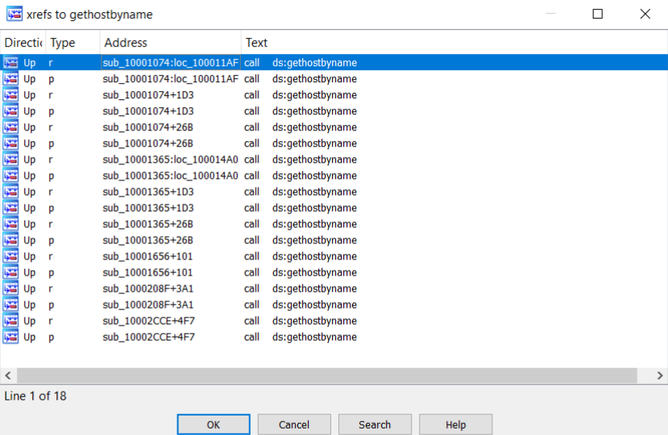
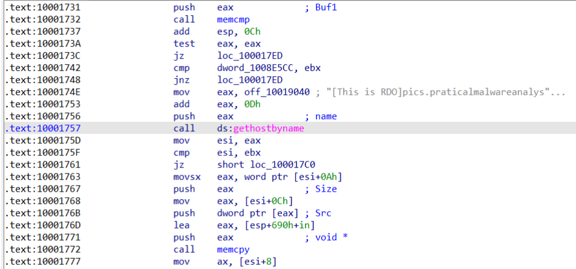
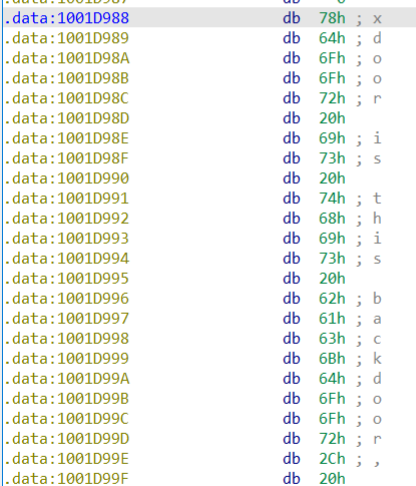

# Malware Analysis: Lab05-01.dll Using IDA Pro

Analyze the malware found in the file `Lab05-01.dll` using only IDA Pro. The goal of this lab is to give you hands-on experience with IDA Pro. If you’ve already worked with IDA Pro, you may choose to ignore these questions and focus on reverse-engineering the malware.

## For revision
Q9-14, 17

## Questions

1. What is the address of `DllMain`?
    - `0x1000D02E`

2. Use the Imports window to browse to `gethostbyname`. Where is the import located?
    - `0x100163CC`

3. How many functions call `gethostbyname`?
    - 5 cross references

    

4. Focusing on the call to `gethostbyname` located at `0x10001757`, can you figure out which DNS request will be made?
    - `off_10019040` is pushed onto the stacked before calling the `gethostname` function. Offset of 13 (`0Dh`) is then added for the domain:
        - `[This is RDO]pics.praticalmalwareanalysis.com`
    
    - DNS domain located at `0x10019194` (`aThisIsRdoPicsP`) + offset of 12:
        - `pics.praticalmalwareanalysis.com`
    
5. How many local variables has IDA Pro recognized for the subroutine at `0x10001656`?
    - 12 local variables (prefixed by `var_`)

    
6. How many parameters has IDA Pro recognized for the subroutine at `0x10001656`?
    - No parameters were recognised (prefixed by `arg_`)

    
7. Use the Strings window to locate the string `\cmd.exe /c` in the disassembly. Where is it located?
    - `0x10095B34`
    
8. What is happening in the area of code that references `\cmd.exe /c`?
    - Cross reference found at `0x100101D0`, part of a larger subroutine at `0x1000FF58`
    - Subroutine seems to create a reverse shell back to the attacker's machine, displaying the infected machine's uptime and idletime, and accepting commands to run on the infected machine.

9. In the same area, at `0x100101C8`, it looks like `dword_1008E5C4` is a global variable that helps decide which path to take. How does the malware set `dword_1008E5C4`? *(Hint: Use `dword_1008E5C4`’s cross-references.)
    - The value is set by function `sub_10001656`, which sets the value to the return value of `eax` after calling `sub_10001000`, which runs `rundll32.exe`.

10. A few hundred lines into the subroutine at `0x1000FF58`, a series of comparisons use memcmp to compare strings. What happens if the string comparison to `robotwork` is successful (when memcmp returns 0)?
    - The malware will listen for commands from the attacker to launch the following processes:
        - `mbase`
        - `mhost`
        - `minstall`
        - `mmodule` 
        - `iexplore`

11. What does the export `PSLIST` do?
    - It gets a list of running processes on the infected machine

12. Use the graph mode to graph the cross-references from `sub_10004E79`. Which API functions could be called by entering this function? Based on the API functions alone, what could you rename this function?
    - Print function
     

13. How many Windows API functions does `DllMain` call directly? How many at a depth of 2?
    - One, `CreateThread`

14. At `0x10001358`, there is a call to Sleep (an API function that takes one parameter containing the number of milliseconds to sleep). Looking backward through the code, how long will the program sleep if this code executes?
    - It will sleep for $n$ seconds, where $n$ is the input entered by the attacker.

15. At `0x10001701` is a call to socket. What are the three parameters?
    - 6, 1, 2

16. Using the MSDN page for socket and the named symbolic constants functionality in IDA Pro, can you make the parameters more meaningful? What are the parameters after you apply changes?
    - address family: 2 (`AF_IPX`)
    - type of socket: 1 (`SOCK_STREAM`)
    - protocol: 6 (`IPPROTO_IGMP`)
    - [MSDN Reference](https://learn.microsoft.com/en-us/windows/win32/api/winsock2/nf-winsock2-socket)

    

17. Search for usage of the `in` instruction (opcode `0xED`). This instruction is used with a magic string `VMXh` to perform VMware detection. Is that in use in this malware? Using the cross-references to the function that executes the instruction, is there further evidence of VMware detection?

18. Jump your cursor to `0x1001D988`. What do you find?
    - There is a series of encoded bytes

    

19. If you have the IDA Python plug-in installed (included with the commercial version of IDA Pro), run `Lab05-01.py`, an IDA Pro Python script provided with the malware for this book. (Make sure the cursor is at `0x1001D988`.) What happens after you run the script?
    - The bytes are decoded into legible characters

    

20. With the cursor in the same location, how do you turn this data into a single ASCII string?
    - Hit `A` to convert to string
    - Decoded string: `xdoor is this backdoor, string decoded for Practical Malware Analysis Lab :)1234`

21. Open the script with a text editor. How does it work?
    - It loops through each byte and decodes it by performing a bitwise XOR operation with `0x55`.
    ```
    # sea = ScreenEA()
    # sea = idc.get_screen_ea()

    # for i in range(0x00,0x50):
    #        b = Byte(sea+i)
    #        decoded_byte = b ^ 0x55
    #        PatchByte(sea+i,decoded_byte)
            
    import idautils 
    import idaapi

    sea = idc.here()

    for i in range(0x00,0x50):
        b = ord(idaapi.get_bytes(sea+i, 1))
        decoded_byte = b ^ 0x55
        ida_bytes.patch_byte(sea+i,decoded_byte)
    ```