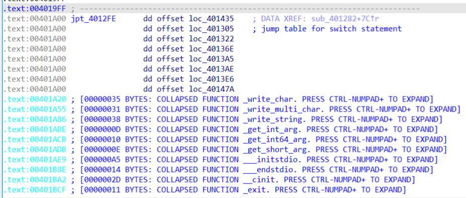

# Lab 6.1
In this lab, you will analyze the malware found in the file `Lab06-01.exe`. 
Questions
1. What is the major code construct found in the only subroutine called by main?
    - Switch implemented using a `jmp` table at `0x00401A00` with 8 cases of subroutine `0x00401282`
2. What is the subroutine located at `0x40105F`?
    - **Revision**: `0x40105F` is a simple `printf` function.
3. What is the purpose of this program?
    - Entrypoint at `0x00401040`
        - Checks for a valid internet connection by calling the subroutine at `0x00401000`, and from there determines if the program terminates normally or not (`eax` = 0 or 1)
    -   At subroutine `0x00401000` (`checkInternetConnection`):
        - Calls the Windows API `InternetGetConnectedState` to check on the Internet connection
        - Proceed to call subroutine at `0x0040105F` regardless of connection status 
    - At subroutine `0x0040105f` (`manipulateFile`):
        - Calls `__stbuf` subroutine to setup buffer
        - Calls subroutine at `0x00401282` to performe some file manipulation
        - Calls `__ftbuf` subroutine to close buffer
    - At subroutine `0x00401282`:
        - Switch with 8 cases using a `jmp` table, to test the value of `eax` from `GetStringTypeW`, located at `0x00401A00`
        
        - Each case writes some character to the file

**Revision**: Malware just checks for an internet connection and proceeds to call the `printf` function to print `Success: Internet Connection` or `Error 1.1: No Internet\n`!

### References
- [Sample Solutions](https://github.com/SafeEval/practical-malware-analysis/blob/master/exercises/lab-06-1.md)