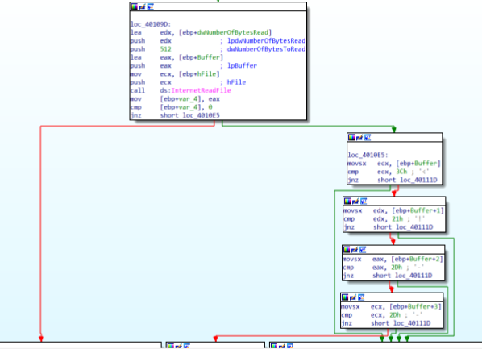

# Lab 6.2
Analyze the malware found in the file `Lab06-02.exe`. 

### Malware Flow
- Entrypoint at `0x00401130`
    - Calls subroutine at `0x00401000` (`checkInternetConnection`)
        - If function returns `1`, proceed to `loc_401148` which calls the subroutine at `0x00401040` (`connectC2`)
            - If subroutine returns `1`, proceed to `loc_40115C` which:
                - Calls `printf` to print `aSuccessParsedC`, which contains `Success: Parsed command is %c`
                - Calls `ds:Sleep` to sleep for one minute (60 seconds)

- Subroutine at `0x00401000` (`checkInternetConnection`)
    - Exact same code as in `Lab6.1`
    - Calls `ds:InternetGetConnectedState` to check if the infected machine has a network connection
    - Proceeds to call `printf` to print network status:
        - `aSuccessInterne`: `Success: Internet Connection`
        - `aError11NoInter`: `'Error 1.1: No Internet'`

- Subroutine at `0x00401040` (`connectC2`), which is the main payload of the malware
    - Calls `ds:InternetOpenA` to open up a browser with user agent specified by `szAgent` (`Internet Explorer 7.5/pma`)
    - Calls `ds:InternetOpenUrlA` to make a connection to the domain referenced by `szUrl` (`http://www.practicalmalwareanalysis.com/cc.htm`), which is probably the attacker's C2 server.
    - Calls `ds:InternetReadFile` to read 512 bytes from the established network file handle
    - Subsequently checks that the command is in the correct format, with `<!--`. Command is stored in the `ecx` register.
        - **Revision**: By fixing the stack to convert `Buffer` into an array of 512 bytes, we can clearly see that each character is read and compared sequentially, one by one
        
    - Upon any failure or error, the subroutine calls `printf` to print the respective error:
        - `aError23FailToG`: `Error 2.3: Fail to get command`
        - `aError22FailToR`: `Error 2.2: Fail to ReadFile`
        - `aError21FailToO`: `Error 2.1: Fail to OpenUrl`

Questions
1. What operation does the first subroutine called by main perform?
    - It checks the internet connectivity of the infected machine.

2. What is the subroutine located at `0x40117F`?
    - It is the `printf` function

3. What does the second subroutine called by main do?
    - It connects to the malware's C2 server located at `http://www.practicalmalwareanalysis.com/cc.htm` to fetch commmands to execute.

4. What type of code construct is used in this subroutine?
    - if-else constructs primarily 

5. Are there any network-based indicators for this program?
    - User agent: `Internet Explorer 7.5/pma`
    - Domain: `http://www.practicalmalwareanalysis.com/cc.htm`
    
6. What is the purpose of this malware?
    - Malware makes a connection to its C2 server at `http://www.practicalmalwareanalysis.com/cc.htm` to fetch commands to execute on the infected machine. Commands are likely hidden as HTML comments, demonstrated by the malware's check for the `<!--` prefix before proceeding. Finally, the malware prints the command received.

### References
- [Sample Solutions](https://github.com/SafeEval/practical-malware-analysis/blob/master/exercises/lab-06-2.md)