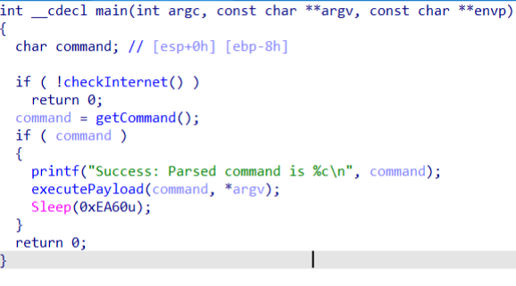
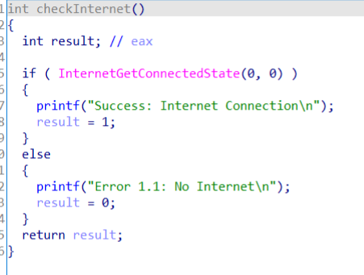
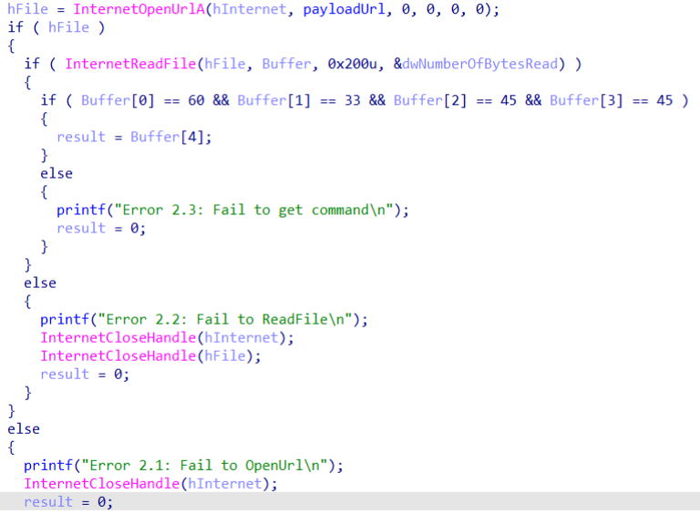
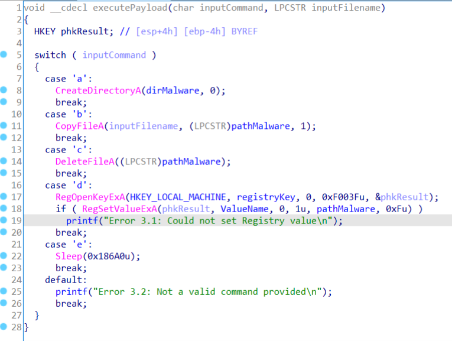

# Lab 6.3
In this lab, we’ll analyze the malware found in the file `Lab06-03.exe`.

### Malware Flow
- Entrypoint at `00401210`:

    

    - Malware checks for internet connectivity by calling subroutine `checkInternet` at `00401000`. If no internet connection is made, the program terminates.
    - Malware proceeds to get a command from its C2 server by calling subroutine `getCommand` at `00401040`. If no command is parsed successfully, the program terminates.
    - If a command is parsed, the malware calls the `executePayload` subroutine at `00401130`, before proceeding to call `Sleep` to sleep for one minute. Afterwards, the program ends

- `checkInternet` subroutine at `00401000`:

    

    - Checks the malware's connectivity to the Internet by calling the `InternetGetConnectedState` function
    - Prints verbose messages using `printf` to indicate connection status
        - `Success: Internet Connection`
        - `Error 1.1: No Internet`
    - Returns `1` if a successful connection is made, and `0` otherwise

- `getCommand` subroutine at `00401040`:
    
    

    - Opens a handle to the Internet using the `InternetOpenA` function, with a user agent set to `Internet Explorer 7.5/pma`
    - Makes a connection to the C2 server at `http://www.practicalmalwareanalysis.com/cc.htm` using the `InternetOpenUrlA` function. If the connection to the C2 server failed, the malware closes the handle and calls `printf` to print `Error 2.1: Fail to OpenUrl\n`. It then sets the return value to `0` before returning to the caller
    - Malware reads the file specified by the previous link using the `InternetReadFile` function. If the read failed, the malware closes the internet handle and prints `Error 2.2: Fail to ReadFile\n` using `printf`.  It then sets the return value to `0` before returning to the caller
    - Malware checks for the characters of the starting tag of a HTML comment `<!--` from the file specified by the link, indicating that it reads the first comment of the file. If the first 4 characters read are wrong, it prints the error `Error 2.3: Fail to get command\n` using `printf` and returns `0` to the caller
    - If the starting characters are correct, the malware proceeds to read the very next single character, before returning control to the caller

- `executePayload` subroutine at `00401130`:

    

    - Checks the parsed character command against a switch of 5 cases for the characters `a`, `b`, `c`, `d`, and `e`. If no valid character is found it prints `Error 3.2: Not a valid command provided` using `printf`, before returning control to the caller
    - Cases:
        - `a`
            - Create `C:\\Temp` directory on infected machine by calling `CreateDirectoryA`
        - `b`
            - Copies the command-line argument executable provided when running the malware to the `C:\\Temp` directory as `C:\\Temp\\cc.exe` by calling the `CopyFileA` function
        - `c`
            - Deletes the command-line argument executable stored at `C:\\Temp\\cc.exe` to remove traces of the malware by calling the `DeleteFileA` function
        - `d`
            - Opens the registry key `Software\Microsoft\Windows\CurrentVersion\Run` by calling `RegOpenKeyExA`, and adds the value for the malware `Malware`:`C:\\Temp\\cc.exe` by calling `RegSetValueExA`. This is used to automatically run the `cc.exe` malware on the infected machine upon startup. If the setting of the registry value failed, it prints `Error 3.1: Could not set Registry value` using `printf`
        - `e`
            - Sleeps for 100 seconds by calling `Sleep`

### Points of Interest
- Embedded Strings
    ```
    Error 1.1: No Internet
    Success: Internet Connection
    Error 2.3: Fail to get command
    Error 2.2: Fail to ReadFile
    Error 2.1: Fail to OpenUrl
    http://www.practicalmalwareanalysis.com/cc.htm
    Internet Explorer 7.5/pma
    Error 3.2: Not a valid command provided
    Error 3.1: Could not set Registry value
    Malware
    Software\Microsoft\Windows\CurrentVersion\Run
    C:\Temp\cc.exe
    C:\Temp
    Success: Parsed command is %c
    ```
- Imports
    - Open & setting of registry values
        - `ADVAPI32.dll`: `RegSetValueExA`
        - `ADVAPI32.dll`: `RegOpenKeyExA`
    - Connection to the Internet, downloading & reading a file
        - `WININET.dll`: `InternetOpenUrlA`
        - `WININET.dll`: `InternetCloseHandle`
        - `WININET.dll`: `InternetReadFile`
        - `WININET.dll`: `InternetGetConnectedState`
        - `WININET.dll`: `InternetOpenA`
    - File manipulation
        - `KERNEL32.dll`: `CreateDirectoryA`
        - `KERNEL32.dll`: `WriteFile`
        - `KERNEL32.dll`: `CopyFileA`
        - `KERNEL32.dll`: `DeleteFileA`
    - Process manipulation
        - `KERNEL32.dll`: `GetCurrentProcess`
        - `KERNEL32.dll`: `TerminateProcess`
        - `KERNEL32.dll`: `GetStartupInfo`
    - Environment strings manipulation:
        - `KERNEL32.dll`: `GetEnvironmentVariableA`
        - `KERNEL32.dll`: `GetEnvironmentStrings`
        - `KERNEL32.dll`: `GetEnvironmentStrings`

Questions
1. Compare the calls in main to `Lab 6-2`’s main method. What is the new function called from main?
    - `executePayload` subroutine at `00401130`

2. What parameters does this new function take?
    - `inputCommand` at `inputFilename`. The former is the parsed command received from the C2 server, whereas the latter is the filename received from the command-line arguments.

3. What major code construct does this function contain?
    - switch construct

4. What can this function do?
    - The function processes the command fetched from the C2 server and executes the respective command.
    - Cases:
        - `a`
            - Create `C:\\Temp` directory on infected machine by calling `CreateDirectoryA`
        - `b`
            - Copies the command-line argument executable provided when running the malware to the `C:\\Temp` directory as `C:\\Temp\\cc.exe` by calling the `CopyFileA` function
        - `c`
            - Deletes the command-line argument executable stored at `C:\\Temp\\cc.exe` to remove traces of the malware by calling the `DeleteFileA` function
        - `d`
            - Opens the registry key `Software\Microsoft\Windows\CurrentVersion\Run` by calling `RegOpenKeyExA`, and adds the value for the malware `Malware`:`C:\\Temp\\cc.exe` by calling `RegSetValueExA`. This is used to automatically run the `cc.exe` malware on the infected machine upon startup. If the setting of the registry value failed, it prints `Error 3.1: Could not set Registry value` using `printf`
        - `e`
            - Sleeps for 100 seconds by calling `Sleep`
5. Are there any host-based indicators for this malware?
    - User agent: `Internet Explorer 7.5/pma`

    - Connected domain/link: `http://www.practicalmalwareanalysis.com/cc.htm`

    - Registry key modification at `Software\Microsoft\Windows\CurrentVersion\Run` with the value: `Malware`:`C:\\Temp\\cc.exe`

    - Presence of the `C:\\Temp\\` directory at malicious payload `C:\\Temp\\cc.exe`

6. What is the purpose of this malware?
    - It connects to the C2 server at `http://www.practicalmalwareanalysis.com/cc.htm` to fetch the command to execute on the infected machine. Depending on the command, the malware will create the `C:\\Temp` directory and copy the malicious executable specified by the command-line argument when it was run into `C:\\Temp\\cc.exe`. It may also modify the `Software\Microsoft\Windows\CurrentVersion\Run` entry of the registry to add the value `Malware`:`C:\\Temp\\cc.exe` to execute the malicious executable at startup, or delete the `cc.exe` file directly to remove traces of infection.