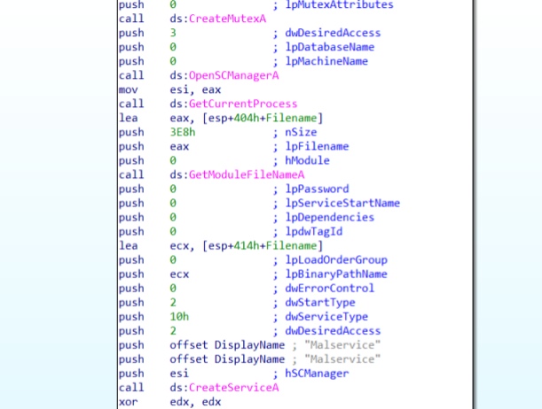
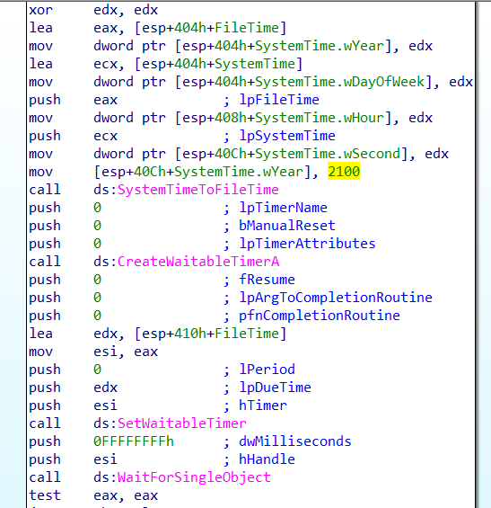
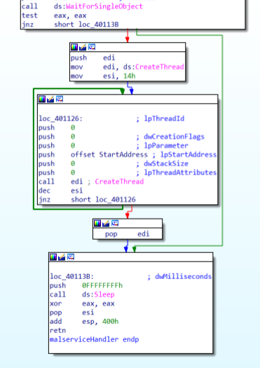

# Lab 7.1 
Analyze the malware found in the file `Lab07-01.exe`.

### Malware Flow
- Entrypoint at `0x00401000`
    - It creates a service by calling `ds:StartServiceCtrlDispatcherA`, with the following parameters:
        - `ServiceStartTable` struct ([`SERVICE_TABLE_ENTRYA`](https://learn.microsoft.com/en-us/windows/win32/api/winsvc/ns-winsvc-service_table_entrya))
            - Name of service (`lpServiceName`): `MalService` (`aMalservice`, located at `0x00405030`)
            - Pointer to service's function entrypoint (`lpServiceProc`): subroutine `sub_401040`, located at `0x00401040` (`malserviceHandler`)
    - Calls the service handler function `sub_401040`, located at `0x00401040` (`malserviceHandler`)

- MalService subroutine at `0x00401040` (`malserviceHandler`)
    - Mutex Access & Creation
        > Mutex is used to ensure only one copy of the malware is running on the infected machine, in any given time 

        

        - Opens a handle to a mutex by calling `ds:OpenMutexA`, with the following parameters:
            - Mutex name (`lpName`): `HGL345`
            - `bInheritHandle` (whether handle is inheritable by child processes): `0` (false)
            - Access rights (`dwDesiredAccess`): `MUTEX_ALL_ACCESS` ([reference](https://learn.microsoft.com/en-us/windows/win32/sync/synchronization-object-security-and-access-rights))
        - If the mutex handle failed, the process is ended by calling `ds:ExitProcess`
            - This indicates that another process has an existing handle to the `HGL345` mutex, which indicates that the machine has already been infected and is running the malware.
        - Conversely, if the mutex handle is created, the mutex is created by calling `ds:CreateMutexA`, with the following parameters:
            - Mutex name (`lpName`): `HGL345`
            - `bInitialOwner`: `0` (false)
            - `lpMutexAttributes`: `0` 

    
    - Service Creation
        > Service called `MalService` is created for the malware to achieve persistence on infected machines, to run in the background

        

        - Preparations
            - Establishes a connection to the infected machine's Service Control Manager by calling `ds:OpenSCManagerA` with the following parameters:
                - `dwDesiredAccess`: `3` (`SC_MANAGER_CREATE_SERVICE ` and `SC_MANAGER_CONNECT`)
            - Obtains process ID by calling `ds:GetCurrentProcess`
            - Get full path of the executable file of the current module by calling `GetModuleFileNameA`, with the filename being returned in register `eax`
        - Creates service by calling `CreateServiceA` with the following parameters:
            - `hSCManager`:  handle to the specified service control manager database, returned previously by `ds:OpenSCManagerA`
            - `lpServiceName`: `Malservice`
            - `lpDisplayName`: `Malservice`
            - `dwDesiredAccess`: `SC_MANAGER_CREATE_SERVICE`
            - `dwServiceType`: `SERVICE_WIN32_OWN_PROCESS` (service that runs in its own process)
            - `dwStartType`: `SERVICE_ERROR_SEVERE`
            - `dwErrorControl`: `0`
            - `lpBinaryPathName`: value returned by `GetModuleFileNameA` previously (fully qualified path to the service binary file)
            - `lpLoadOrderGroup`: `0` 
            - `lpdwTagId`: `0`
            - `lpDependencies`: `0` 
            - `lpServiceStartName`: `0` 
            - `lpPassword`: `0` 
    
    - Waitable Timer Creation
        > Waitable timer is used for malware to lay dormant until the scheduled date of execution, which is in year 2100

        

        - Create a `SYSTEMTIME` struct by calling `ds:SystemTimeToFileTime`, with the following parameters:
            - `SystemTime.qYear`: `2100` 
        - Creates a timer by calling `CreateWaitableTimerA` with the parameters:
            - `lpTimerAttributes`: `0`
            - `bManualReset`: `0`
            - `lpTimerName`: `0`
        - Activates the timer by calling `SetWaitableTimer`
            - Malware is scheduled to execute in the year 2100
        - Wait for the `WaitableTimer` to be signalled, by calling `WaitForSingleObject` with the parameters:
            - `dwMilliseconds`: `0x0FFFFFFFF` (wait indefinitely until the object becomes signaled. There is no timeout, and the function only returns when the object is signaled)
        - Return value of `WaitForSingleObject` is used to determine malware's subsequent behavior (to lay dormant or deliver its payload)

- Payload Behavior
    > Malware is scheduled to deliver payload in the year 2100

    
    
    - After calling `WaitForSingleObject`, its return value is used to determine the malware's behavior.
    - If the return value is `WAIT_OBJECT_0` (0) the malware calls `ds:Sleep` to sleep indefinitely (A value of INFINITE indicates that the suspension should not time out)
    - If the return value is `WAIT_ABANDONED` or `WAIT_TIMEOUT` or `WAIT_FAILED`, a new empty thread is created using `ds:CreateThread`, and the malware enters a loop of 20 iterations to create new threads using `CreateThread` that executes code at `0x00401150` (`StartAddress`). After the loop, the malware sleeps indefinitely.

- Thread execution at `StartAddress` (`0x00401150`):

    

    - Establishes an Internet connection by calling `ds:InternetOpenA` with the following parameters:
        - `lpszAgent`: Internet Explorer 8.0 (specifiec by `szAgent`)
        - `dwAccessType`: 1 (`INTERNET_OPEN_TYPE_DIRECT`)
        - `lpszProxy`: 0
        - `lpszProxyBypass`: 0
        - `dwFlags`: 0
    - Makes a connection to the `http://www.malwareanalysisbook.com` domain specified by `szUrl` using `InternetOpenUrlA`, with the following parameters:
        - `hInternet`: handle to the current Internet session, stored in register `esi`
        - `lpszUrl`: `http://www.malwareanalysisbook.com`
        - `lpszHeaders`: 0
        - `dwHeadersLength`: 0
        - `dwFlags`: `INTERNET_FLAG_NO_CACHE_WRITE`
        - `dwContext`: `loc_40116D`

#### Notable API Calls
- `InternetOpenUrlA`, `InternetOpenA`
- `CreateServiceA`, `StartServiceCtrlDispatcherA`, `OpenSCManagerA`

Questions
1. How does this program ensure that it continues running (achieves persistence) when the computer is restarted?
    - It creates a service called `MalService`

2. Why does this program use a mutex?
    - It is used to ensure only one copy of the malware is running on the infected machine.

3. What is a good host-based signature to use for detecting this program?
    - Service: `Malservice`
    - Mutext: `HGL345`

4. What is a good network-based signature for detecting this malware?
    - User agent: `Internet Explorer 8.0`
    - Domain: `http://www.malwareanalysisbook.com`

5. What is the purpose of this program?
    - The malware creates a background process/service called `MalService` that lays dormant, and will make connections to the `http://www.malwareanalysisbook.com` domain. 

6. When will this program finish executing?
    - It will lay dormant and never finish execution.